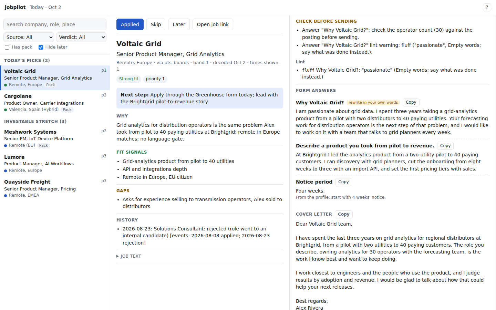

# CometScout

> CometScout was called jobpilot until October 2026. The old names (the `jobpilot` command, `JOBPILOT_*` variables, the `jobpilot` systemd units, `jobpilot-*` backups and exports, the `X-Jobpilot` header) still work for a release or two; `node cli.mjs doctor` says what to rename, and `node cli.mjs timer` replaces the old units.

A self-hosted job search pipeline that runs every evening on your own server and ends with something you can act on: **up to two roles worth applying to, each with a CV tailored from your own checked wording and draft answers for its application form.**

It is built by a product manager for his own search (seven applications in four days once it was running) and uses the Claude or ChatGPT subscription you already have. Your data never leaves your server except for the model calls.

## How it works

```
sources  ─►  gates  ─►  inbox  ─►  decode  ─►  picks  ─►  application pack  ─►  Telegram
(job boards,  (language,           (your profile,  (best 2 a day,  (tailored CV PDF,
 alerts,       permit, place,       fit verdict,    dead links and  cover letter if the
 feeds)        company, industry)   fact check)     closed roles    form asks, drafted
                                                    skipped)        form answers, lint)
                                         ▲
Gmail outcomes ─► applications ──────────┘  (rejections, interviews and offers close roles for the picks)
```

- **Sources** (all optional): public Greenhouse, Ashby and Lever boards of your target companies (no login); RealtimeJobs API (your token); LinkedIn and hh.ru job-alert emails, read from your Gmail with read-only access, each job's full text taken from the public job page; Hirify saved filters (your own session); the findings of your own career-ops scans; any outside tool that drops job files into a folder (drop-dir, e.g. OpenClaw).
- **Gates:** hard rules every source applies before a job costs a model call: posting language, work permit and citizenship, on-site countries, remote scope, sponsorship refusals, excluded companies, agencies and industries. A missing or unclear field never rejects a job; it is flagged for the decoder. Duplicates are caught across company aliases and against roles you already applied to.
- **Decode:** each job is judged against `profile/profile.md`: your experience, what you want, location and work permit, hard gates, and scope guards (what you must never claim). Verdicts: strong fit, investable stretch, long shot (with the reason it was held), weak fit, gate.
- **Picks:** the best two open roles of the last two weeks, different companies, remote first, links checked, roles you are already in process for excluded.
- **Outcomes:** with Gmail connected, answers to your applications (received, rejection, interview, test task, offer) are recognised and recorded, so a role you are already in process for never comes back as a pick.
- **Reports:** your applications as a [job-pipeline-tracker](https://github.com/Dreamkeeper/job-pipeline-tracker) file, a monthly scorecard of which source earns its price, a health ping and a Telegram alert when a run fails, labels in English or Russian.
- **Application pack:** the CV is assembled only from `profile/cv-library.json`, text you approved. The model selects and orders; it may write only the tagline and summary, and both are checked against your fact rules. The finished CV, cover letter and answers are checked against your [lint rules](#lint-rules); a CV that would still carry a banned claim is not sent. The application form is read automatically for Ashby, Greenhouse and Lever, and every non-personal question gets a draft in your voice (`profile/voice.md`). Sections and company blocks are kept whole across the page break whenever two pages have room (the pack says so when they do not). A "check before sending" list names every decision that is yours (salary, location, gaps).

## Quick start

On a Debian or Ubuntu VPS, as your normal user:

```bash
git clone https://github.com/Dreamkeeper/cometscout.git && cd cometscout
bash deploy/install.sh
```

Then open the folder in **Claude Code** or **Codex** and say **"set me up"** (step by step, from a fresh server: see [Install guides](#install-guides)). The agent follows `AGENTS.md`: it interviews you for the profile, turns your CV into the library (you approve every line), connects a first source, and shows you a real decoded job and its tailored CV in the same sitting. Telegram delivery and the daily timer come after.

Try it before onboarding: with no `profile/`, CometScout runs on the fictional example profile in `profile.example/`.

## Commands

```bash
node cli.mjs doctor                       # what is set up, what is missing
node cli.mjs run                          # the evening run (the timer calls this)
node cli.mjs sources | decode | picks | pack
node cli.mjs applied <company> [role]     # you applied: picks move on
node cli.mjs status <company> screen|interview|offer|accepted|rejected|skipped|closed [role] [--note "..."]
node cli.mjs list
node cli.mjs interview <company> <YYYY-MM-DD> [HH:MM] [role] [--round "..."]   # a booked interview: prep mode starts before it
node cli.mjs timer [HH:MM]                # reinstall the daily timer from settings.json (schedule.time, timezone), and the bot with Telegram on
node cli.mjs bot                          # the Telegram bot: /schedule, /time, /interview, /help (the timer installs it as a service)
node cli.mjs reset --yes                  # clear data/ (e.g. after trying the example profile)
node cli.mjs tracker-export [--out <file>] [--dry-run]   # applications as a job-pipeline-tracker import file
node cli.mjs sources-report [--send]      # which source earns its price
node cli.mjs notify <text>                # one Telegram message (the failure alert uses it)
node cli.mjs export [--out <file.zip>] [--data-only] | export --csv <file.csv>
node cli.mjs import --from <file.zip> [--dry-run] [--on-conflict keep|theirs|both] [--data-only]
node cli.mjs export-secrets --out <file> | import-secrets --from <file>
node cli.mjs backup [--label <text>] | backups | restore <backup> [--dry-run]
node cli.mjs serve [--port 8787]          # the workspace in your browser (preview), see below
node cli.mjs coach-handoff [--out <file>] # your profile, CV, voice and applications for the interview coach, see below
node cli.mjs update [--to vX.Y.Z] | --check | --tonight | --skip vX.Y.Z   # updates, see below
node cli.mjs rollback [--to vX.Y.Z] [--restore-data]                     # back to the previous version
node cli.mjs evals sample | sets | decode | pack | voice                  # evals against your own labels, see below
```

## Workspace (preview)

A web screen for the daily routine: today's picks, the decode, the pack, then applied, skip or later. It is a first probe of the workspace (see `ROADMAP.md`, M5): one screen, no sign-in yet.

```bash
npm install                  # once: preact and htm, the two browser libraries (deploy/install.sh does this)
node cli.mjs serve           # then open http://127.0.0.1:8787
```

- **It listens on 127.0.0.1 only.** Nobody else can reach it, and a page on another site cannot use it either (requests must name the server's own address, and every write needs a header a browser form cannot send). On a VPS, forward the port from your computer: `ssh -L 8787:127.0.0.1:8787 <your-vps>`, then open `http://127.0.0.1:8787` locally. `--host` with any other address is refused until sign-in exists; `--unsafe-no-auth` overrides that and warns on every start. A wildcard address (`0.0.0.0`, `::`) is refused even then: bind the address you will open. `--port` picks another port.
- **Left:** today's picks first (the ones the evening run chose; "Picks of Oct 1" when the latest picks are older, for example after a failed run), then every other role the picks could still choose, grouped by verdict. Search, and filters for source, verdict, "has pack" and "hide later" (the filters are remembered in this browser, the search text is not).
- **Middle:** the job: company, role, location, source, band, verdict and priority, the next step, why, fit signals, gaps, why held, fact check, your history with the company, and the job text (folded).
- **Right:** the pack: "Check before sending" (flags and lint) first, then the form answers with a copy button each, the cover letter, the CV PDF (half the pane; "Larger preview" grows it), the files and the apply link. An older pack (a `<date>--<company>` folder, or one without `pack.json`) is shown from its `answers.md`, and the pane says so instead of claiming nothing was flagged.
- **Settings and interviews:** Settings (top bar) sets the digest days, the time and the prep window. Record interview (in the job's header) records a booked interview with its date, time and round. During prep mode the list opens with the interview and the day's prep step.
- **Actions:** Applied, Skip (with a reason: too senior, too junior, wrong domain, location or visa, language, company, already in contact, other), Later (1, 3 or 7 days) and Open job link. After an action the next job opens. Applied and Skip write the same record as `node cli.mjs status` (the event says `source: "workspace"`); Later adds a `later` event and keeps the job out of the picks and, with "hide later", out of the list until that day. A note is at most 500 characters, on the command line too. While the evening run (or a decode, pack, import, backup or restore) holds the run lock, actions answer "CometScout is busy, try again in a minute" and nothing is written. Every write carries the header `X-CometScout: 1` (the old header name is still accepted).
- **Keyboard** (desktop): `j` / `k` next and previous, `a` applied, `s` skip (then `1` to `8` for the reason), `l` later (then `1`, `3` or `7`), `o` open the job link, `/` search, `?` help, `Esc` closes a dialog. Dialogs take the focus and keep `Tab` inside.
- On a phone (or any window under 1100 px) it is one column: the list, then the job with tabs Job and Pack and the actions fixed at the bottom. Light and dark follow your system; labels follow `locale`.

To see it before you have data of your own, write the demo data (invented jobs and packs for the example profile) into an empty folder and point the server at it:

```bash
node tools/workspace-demo.mjs --out /tmp/cometscout-demo
COMETSCOUT_DATA=/tmp/cometscout-demo node cli.mjs serve
```



## Evals

Numbers instead of impressions: how often a "worth applying" verdict matches what you would have said, how many good roles it hides, and whether a new prompt writes better packs than the old one. Your labels stay in your own `data/evals/`; the repository holds only synthetic fixtures. Export and backups include `data/evals`.

| Eval | What it answers |
|---|---|
| `evals decode` | Do the verdicts match your labels? A confusion table (surfaced, meaning strong fit or investable stretch, against your yes or no), surfaced precision and recall with their counts, the good roles it missed and the noise it surfaced (each with your reason), gate rejects you would have wanted, fact-flag counts. |
| `evals decode --compare` | Is system B better than system A on the same labelled jobs? Both tables, the jobs where they disagree, which one your label agreed with, the paired counts and an exact McNemar p-value. |
| `evals pack` | Which of two sets of packs for the same jobs is better? A blind model judge, each pair judged twice with the order swapped. |
| `evals voice` | Do the generated cover letters and answers sound like you? |

**1. Make a label set.** About 70 jobs, drawn evenly across the verdicts (worth applying, held, weak, gate rejects, unreadable), so rare verdicts are in it too. The same seed gives the same sample.

```bash
node cli.mjs evals sample --set week-41 [--size 70] [--from 2026-09-01] [--to 2026-10-01] [--seed 1] [--include <queue file>]
```

This writes `data/evals/week-41/sample.json`: the jobs' text as the decoder saw it, frozen now. No verdict is stored; the evals read it from the queue later.

**2. Label it, in one focused sitting.** `node cli.mjs serve`, then open `http://127.0.0.1:8787/label?set=week-41`. One job at a time with its title, company, location and description, never the verdict, gates or decoder notes. Answer "should I have seen this as worth applying to?": Yes, No or Unsure, with a one-line reason (optional for Yes and No, required for Unsure: which fact is missing). Keys: `Y`, `N`, `U`, `Enter` saves and goes on, the arrows move. You can go back and change a label, and the screen opens where you stopped. If `profile/eval-rubric.md` exists (your own criteria; the onboarding can draft it from your profile, see `profile.example/eval-rubric.md`), it is shown next to the job. It works on a phone, but a computer and one sitting give better labels. Every save appends a line to `labels.jsonl`, and the latest line per job wins.

**3. Run the evals.**

```bash
node cli.mjs evals decode --set week-41                          # the verdicts already in the queue
node cli.mjs evals decode --set week-41 --system replay          # decode the sampled jobs again now, with today's prompt
node cli.mjs evals decode --set week-41 --system replay --compare queue
node cli.mjs evals decode --set week-41 --system file:other.json # verdicts from any other pipeline: { "<queue file>": "<verdict>" }
node cli.mjs evals pack --a <packs folder> --b <packs folder> [--judge-model opus]
node cli.mjs evals voice --dir data/packs
```

- `replay` is a dry run: nothing in the queue changes, the verdicts go to `data/evals/<set>/replay-<date>.json` (which `file:` can read back), and each job's history with the company is cut at the job's own date, so no later rejection or decode leaks into the prompt. A job with no date is skipped (its history cannot be cut). The files in `decoder.context_files` cannot be cut by date; the replay says so, and `--no-context` leaves them out. A job the decoder gave up on (`failed`) counts as having no verdict, not as "not surfaced".
- Labels travel with export and backups (`data/evals`). To bring labels from another install, import with `--on-conflict both` and append the copied `labels.jsonl` lines to yours: the newest line per job wins, so nothing is lost.
- Reports are written next to the set as `report-<date>-<system>[-vs-<other>].md` and `.json`. Unsure labels stay out of the rates and are counted on their own. The sample is stratified, so the rates describe the sample, not your whole queue.
- `evals pack` pairs pack folders by name without the date (`<date>--company--role`). A pair counts only when both orders pick the same pack; otherwise it is "inconsistent" (the order decided, not the content). A pack whose CV, cover letter or answers break a banned lint rule loses without a judge call. The report lists wins, ties, inconsistent pairs and the judge's reasons, then the lint failures. Written to `data/evals/pack-report-<date>.md`.
- `evals voice` needs `profile/voice.md` or your own writing in `profile/voice-samples/*.md`. Each cover letter and answer of 15 words or more gets a score from 1 to 5 and the phrases that sound least like you; the report has the mean, the distribution, the worst five and the lint phrases counted in the same texts. Written to `data/evals/voice-report-<date>.md`.
- Model calls use your own Claude Code or Codex subscription, like decode and pack.

**Do not tune the prompt on the labels you report on.** If you change the prompt until one set looks good, its numbers say more about that set than about the prompt. Keep a second, held-out set and quote its numbers.

## Configuration

| File | What | Committed? |
|---|---|---|
| `settings.json` | model provider (`claude` or `codex`) and models, sources and their filters, picks, Telegram | no |
| `.env` | tokens: `RTJ_API_TOKEN`, `HIRIFY_COOKIE`, `TELEGRAM_BOT_TOKEN`, `TELEGRAM_CHAT_ID`, `GMAIL_*` (written by `tools/gmail-auth.mjs`) | no |
| `profile/` | `profile.md`, `cv-library.json`, `fact-rules.json`, `lint-rules.json`, `voice.md`, `cover-letter-template.md` | no |
| `data/` | the queue, digests, packs, state | no |

Models: decoding uses `llm.model` (a mid-size model is enough), packs use `llm.pack_model` (use the strongest you have). On smaller plans, lower `decoder.cap` or use a smaller model.

The `cometscout` command is the same as `node cli.mjs`: run `npm link` once in this folder to put it on the PATH.

`COMETSCOUT_HOME`, `COMETSCOUT_DATA` and `COMETSCOUT_SETTINGS` point CometScout at another folder, data directory or settings file (handy for trials and evals). `node cli.mjs timer` keeps a `COMETSCOUT_HOME` that is set: the units run `cli.mjs` from the code folder with that home.

### Companies, duplicates and statuses

**Company aliases.** When one employer goes by several names (a brand and its parent, a short name), list them together in `queue.aliases`:

```json
"queue": { "aliases": [["Acme Robotics", "Acme"], ["Northwind Labs", "Northwind", "NWL Group"]] }
```

A company belongs to a family when one of the family's names occurs in it as whole words ("Acme Robotics Inc." is in the Acme family; "Motorola" is never in a family named "Ola"). Names shorter than 3 characters only match the whole company name. Two companies are the same employer when their families share a name, or when one name is contained in the other as whole words ("Ridgeway" and "Ridgeway Labs", either way round). The contained name must be at least 4 characters and not a single generic word (labs, group, inc, corp, holdings, technologies, systems, gmbh, ltd, llc, ооо, ао), so "Labs" is not "Ridgeway Labs". An empty or "Unknown" company never matches anything. The aliases are used by the duplicate check, the decoder's history and the picks. The outcomes source uses a stricter match: the names are equal, in one family, or one is the other plus extra words.

**Duplicates.** A new job is skipped when its link was queued before, or when the same company posted the exact same title within `queue.dedupe_days` (default 60) in an overlapping location. On top of that, a job that repeats one of your applications (`data/state/applications.json`, any status) is skipped: same employer (aliases included) and role titles sharing more than half of the shorter title's words. Words of two letters and generic words do not count: seniority, job words (manager, engineer, developer and the like), filler, and words nearly every title in a product search has (product, owner, продукта, продукту). So "Senior Product Manager, Growth" and "Product Manager, Hardware" are two roles, as are "Software Engineer, Backend" and "Software Engineer, Mobile"; "Senior PM, Robotics" and "Product Manager, Robotics" are one. Add your own generic words with `queue.role_stopwords` (`["platform"]`). A job you only decoded does not count this way, so a second, different opening at that company still reaches you. Placeholder companies ("Confidential (Hirify)") and unknown companies are matched by link only.

**Statuses.** `applied`, `screen` (a recruiter screen), `interview`, `offer` (an open offer), `accepted` (an offer you took and now work in, while you keep looking), `rejected`, `skipped`, `closed`; outcomes from Gmail may also record events. Only you set `accepted`: an email never sets it, and an offer or any other email never moves an accepted application to another status (its event is still recorded). A job you hold is not an open process: the coach hand-off lists it under "Jobs I hold", not as in progress. A role with any of these statuses (or `withdrawn`), or with any recorded event, never becomes a pick again, nor does another opening for the same role at the same employer. Here "the same role" is looser than for duplicates: titles sharing at least half the shorter title's words of three letters or more, generic words included. A record whose role has no such words (no role, or just "PM") closes every pick at that employer; `node cli.mjs applied` and `status` say so when you record one.

`data/state/applications.json` is your own record, so CometScout never guesses around a broken one: when it is not valid JSON, `node cli.mjs run` and `sources` stop before any source runs, each source stops before it marks anything seen, the decoder (`decode`, `picks`) stops before it decodes or picks anything, and `applied` and `status` refuse to write. Fix the file (a trailing comma is the usual cause) and run again.

### Decoder

`decoder.prompt_file` (optional) replaces the built-in `decoder/prompt.md` with your own prompt: an absolute path, or a path relative to the profile folder. It uses the same `{{NAME}}` and `{{PROFILE}}` placeholders. `node cli.mjs doctor` shows which prompt is in use, and both doctor and the decoder stop with a clear message when the file is missing.

The decoder tells the model what happened before with the company (your applications and their events, past decodes), matching the company through the aliases.

Fact rules in `profile/fact-rules.json` are checked against the rationale, the action, the hold reason, the fit signals and the gaps. Each rule reports its first match. A rule with `"guard": true` ignores a match that is denied or that describes the employer's opening rather than you: a negation word (never, not, no, nor, without, wasn't, isn't) in the 50 characters before it, or an employer word right after it (hire, mandate, role, req, seat, or a colon). So with a guarded rule for "first PM", "was never the first PM" and "the first PM hire" do not flag, and "as the first PM there" does:

```json
{ "id": "first-pm", "pattern": "\\bthe first PM\\b", "why": "The candidate was never a company's first PM.", "guard": true }
```

### Picks

Every evening the best open roles from the last `picks.window_days` (14) are picked, `picks.per_day` (2) of them, one per employer (aliases count), each shown at most `picks.max_shown` (3) times. The ranking weighs the decoder's priority most, then the work shape (fully remote, then remote with office days, then on-site), then the board's `band` when a source gives one (1 best to 4; unknown counts as 2.5), then age and how often the job was shown. A job with no company (or "Unknown") is never a pick, and a link that is closed or archived (Greenhouse and Lever 404, Ashby, LinkedIn "no longer accepting", archived hh.ru and Hirify vacancies) is skipped; when the page cannot be checked (a network error, 403, 429) the job stays.

```json
"picks": {
  "per_day": 2, "window_days": 14, "max_shown": 3,
  "exclude_location_regex": "",
  "exclude_onsite_location_regex": "",
  "shape_bonus": [{ "location_regex": "barcelona|spain", "rank": 1 }]
}
```

- `exclude_location_regex`: never pick a job whose location matches, remote or not.
- `exclude_onsite_location_regex`: never pick a job whose location matches unless it is fully remote (a fully remote job from that country stays). A location carrying `remote_scope:` (queue files imported from other tools, such as "Madrid, ES (remote_scope: geo_restricted, regions: Europe)") counts as remote for any value but `none`.
- `shape_bonus`: the first entry whose `location_regex` matches sets the shape rank of a job that is not fully remote (fully remote is 0, remote with office days 1.5, on-site 2), so an office in a city you like can rank with remote roles.

### Digest days and interview prep

The evening run starts every day at `schedule.time` in `timezone`, and sends its digest on `schedule.days` (ISO weekdays, 1 = Monday). Change both in the workspace (Settings) or in the Telegram bot (`/schedule`, `/time`); a time change reinstalls the timer. An older `run_time` still works as the time, and `doctor` suggests moving it.

```json
"schedule": { "days": [1, 2, 3, 4, 5], "time": "18:00" },
"picks": { "prep": { "days_before": 2, "max": 1, "verdicts": ["strong-fit"], "max_priority": 1, "fresh_days": 2 } }
```

- **Off days** (not in `schedule.days`): sources and decode still run, so nothing piles up, but nothing is sent (no digest, no outcomes report in Telegram) and no picks are shown or counted. The digest is still written to `data/digests/`, with a first line saying it was an off day. The first digest after off days opens with one line: which days were held back, how many roles were decoded and how many are worth applying to (they are in the picks pool). Failure and backup alerts still go out.
- **Prep mode:** when an interview is 1 to `days_before` days ahead, or later today (an interview with no time counts as later today), the digest opens with the interview (company, round, day, time, "tomorrow") and the day's prep step: 2 or more days out, research and likely concerns; the day before, practice or a mock; the day itself, a short confidence plan and a warm-up answer. With the interview coach enabled it names the coach command (`prep <company>`, `practice` or `mock`, `hype`). Then at most `max` pick, and only a `strong-fit` with apply priority 1 decoded in the last `fresh_days` days (today and yesterday); otherwise "N roles wait until after the interview". Roles that wait keep their showings. Today's new finds are listed one line each, for after the interview. `days_before: 0` turns prep mode off. The workspace's Today screen shows the same lines.
- **Where interview dates come from:** an `interview` event with an `event_date` today or later, and `event_time` (HH:MM, your time zone) when known. Outcomes from Gmail fill both when the email states them; `node cli.mjs interview <company> <YYYY-MM-DD> [HH:MM] [role words] [--round "..."]`, the workspace's Record interview button and the bot's `/interview` record one by hand (and set the status to `interview` unless it is already `offer` or `accepted`).

### Telegram bot

`node cli.mjs bot` long-polls Telegram and answers only the chat in `TELEGRAM_CHAT_ID`; anyone else gets no answer. `node cli.mjs timer` installs it as a systemd user service (`cometscout-bot.service`) when Telegram delivery is on.

- `/schedule`: digest days, time and the prep window, with buttons to switch each day on or off and to set prep days (0, 1, 2, 3).
- `/time HH:MM`: the digest time (the timer is reinstalled).
- `/interview <company> <YYYY-MM-DD> [HH:MM] [role words]`: the same as the command; put a company name with spaces in quotes.
- `/update`: the installed and the newest version, with Update now, Tonight and Skip when a newer one is out (see Updates).
- `/help`: the commands.

The bot and the workspace save through the same writer: it checks the values like `doctor`, changes only those keys in `settings.json` (your other keys and layout stay), and reinstalls the timer only when the time changed (on a host without systemd it says to run `node cli.mjs timer`).

### Gates

Gates are hard rules every source applies before a job is queued, so a job you could never take costs no model call. They live in `settings.gates`; every key is optional, and a missing key means no check. With no `gates` block at all, sources work exactly as before. The example file turns some gates on (languages, work authorization, on-site countries, remote regions, sponsorship phrases); edit them to fit you.

```json
"gates": {
  "user": { "citizenships": [], "work_authorization": ["ES"] },
  "languages": ["en", "es"],
  "onsite_countries": ["ES"],
  "remote": { "accept_worldwide": true, "accept_regions": ["Europe*", "EU", "EEA", "EMEA"] },
  "sponsorship_refusal_phrases": ["without sponsorship", "no visa sponsorship", "must be authorized to work in"],
  "must_reside_phrases": [],
  "headcount": { "demote_over": null, "reject_over": null, "demote_unless": ["remote_worldwide", "remote_region", "sponsorship"] },
  "companies": { "exclude": [], "agencies": [] },
  "industries": { "exclude": [], "exclude_combos": [] }
}
```

Checks run in this order, and the first one that rejects wins:

1. **company:** the company is in `companies.exclude` or `companies.agencies`.
2. **industry:** an industry, the company or the title matches `industries.exclude`; or the job's industry tags match every term of one entry in `industries.exclude_combos` (e.g. `[["gaming", "mobile"]]` rejects a mobile-gaming studio but not a gaming-hardware maker or a mobile app).
3. **language:** the posting is in none of your `languages`, or it needs another language at B2 or higher (a lower level is only flagged). Codes compare by language only, so `en-US` counts as `en`; names and 3-letter codes (`English`, `eng`, `spa`, `ger`) count as the 2-letter code.
4. **legal:** your citizenship is not accepted, or a work permit is required (or sponsorship refused) for an on-site job outside `user.work_authorization`. When the source says sponsorship is available, this is a flag, not a reject. For jobs that are not on-site only (remote, or attendance unknown) it is a flag too.
5. **geo:** an on-site or hybrid job with no country in `onsite_countries`, or a job that excludes a country you can work in.
6. **remote:** a remote job limited to regions you did not accept, worldwide remote when `accept_worldwide` is false, or a `must_reside_phrases` hit. A region is accepted when it matches `accept_regions` or names a country in `work_authorization` or `onsite_countries` ("Spain", "the Netherlands", "España", "ES"). A job that also has an office or hybrid location in one of those countries passes with a flag; so does one with a location there whose attendance is not listed (flagged "attendance unknown"), but a remote-only location there does not count. Without `accept_regions`, or when the job lists no regions, a region limit is only flagged. Region text with an exclusion ("Worldwide except US", "кроме") is always flagged for you to check and never rejects by itself.
7. **headcount:** off unless you set it (`null` means no limit). More people than `reject_over`, or more than `reject_keywords_over.min` with one of its keywords in the industries or title, rejects. Over `demote_over`, the job is held back (demoted) unless one of `demote_unless` holds.

Names match as whole words, case-insensitive, in any script; end a term with `*` to match word prefixes (`Europe*` matches "European Union"). A field a source does not know (RealtimeJobs gives the most, ATS boards and LinkedIn give the least) never rejects a job. Each source logs how many jobs each gate stopped, and flags on a queued job go into its `gate_flags` field. Demoted jobs are not lost: each one is added once to `data/state/demoted.jsonl` (date, source, company, role, url, gate, reason), so you can look them over before lowering the bar. `node cli.mjs doctor` shows which gates are on and warns about unknown keys.

### hh.ru alerts

For hh.ru users: with `sources.hh_alerts.enabled`, every run reads your hh.ru saved-search emails ("Вакансии по подписке") and resume-match emails ("Подходящие вакансии") from Gmail (read-only, the same access as LinkedIn alerts: run `node tools/gmail-auth.mjs` once), takes the vacancy numbers from them and reads each public vacancy page, without logging in to hh.ru. The links in those emails carry a login key; CometScout never opens, logs or stores them, it only opens `https://hh.ru/vacancy/<number>` and does not follow redirects. Jobs are queued with `source: "hh"`, the city and work format as the location, the salary, experience and employment type, and the alert names in `notes`.

```json
"hh_alerts": {
  "enabled": true, "sender": "noreply@hh.ru",
  "first_run_hours": 72, "overlap_hours": 24, "max_lookback_hours": 168,
  "max_fetch": 40, "delay_ms": 3000,
  "title_include": ["менеджер продукта", "продакт*", "product manager", "product owner"],
  "title_exclude": ["стажер", "стажёр", "intern", "junior"],
  "must_reside_phrases": ["находиться на территории РФ", "находиться в РФ", "проживать в России", "проживающий в России", "проживающих в России"],
  "abroad_signals": ["из любой страны", "релокант*"],
  "tax_residency_phrases": ["налоговый резидент*"],
  "city_countries": { "Лимасол": "CY" }
}
```

- `title_include` and `title_exclude` take Russian and English terms (whole words; end a term with `*` for word prefixes). An empty `title_include` lets every title through. In the example above, `"продакт*"` keeps "Продакт-менеджер" and "продакт менеджер".
- `must_reside_phrases`: for a remote job, phrases that mean you must live in a given country. A hit rejects the job (gate `geo-remote`). Useful when you live abroad and many remote jobs need you to be in Russia; the example file leaves it empty.
- How phrases match (all the lists here): whole words, case-insensitive, with no other folding. "ё" and "е" are different letters, so list both spellings ("стажер", "стажёр"). Word endings are not folded either, so "проживать в России" does not match "проживающий в России": list each form you want caught. A `*` matches a word prefix only at the very end of a term ("продакт*", "налоговый резидент*"); inside a phrase it is an ordinary character.
- `abroad_signals`: phrases that suggest working from abroad is fine. When the list is not empty, every remote job gets a flag: the signals found, or "confirm working from your country is allowed" when there are none.
- `tax_residency_phrases`: a hit adds a flag (a tax residency requirement is worth checking before you apply).
- `city_countries`: extra city to country pairs. The city and country come from the vacancy page itself when it has them; otherwise the city is read from the address and looked up in a built-in table of major Russian and nearby cities, then in `city_countries`. The country is what the on-site gate checks, so an on-site job in Moscow is rejected when RU is not in your `gates.onsite_countries`. A city that is not known leaves the country empty, which never rejects.

The shared gates then apply as for every source. A posting written mostly in Cyrillic counts as Russian for the language gate, so add `"ru"` to `gates.languages` if you use that gate (`doctor` warns when it is missing). Pages are read one at a time, at least 2 seconds apart (`delay_ms`, default 3), at most `max_fetch` per run. A 403 alone means the vacancy is hidden from visitors who are not logged in; two 403s in a row or a 429 mean hh.ru is slowing CometScout down, so the run stops. Archived and removed vacancies are skipped. A page without a title or description is not marked seen but tried again on later runs (3 times at most); three such pages in a row stop the run (hh.ru probably changed its page layout). Vacancies left over for any of these reasons, or past `max_fetch`, are kept in `data/state/hh-alerts.json` and tried first on the next run. Try it with `node sources/hh-alerts.mjs --dry-run` (writes nothing) or look further back with `--hours 168`. `--ids 123456789,987654321` only looks: it reads those vacancies (no Gmail, even ones seen before), prints what would happen to each, and writes no job files, does not mark them seen and leaves the state file alone.

### Outcomes from Gmail

With `sources.outcomes.enabled`, every run reads recent emails (read-only, the same Gmail access as LinkedIn alerts) and looks for answers to your applications: received, rejection, interview, test task, offer. Job alerts, newsletters and job-board notices ("your application was viewed", "похожие вакансии", resume statistics) are skipped without a model call (by subject; job boards such as hh.ru also send real invitations and rejections, so their senders are not skipped). Each remaining email is classified by the model (the body decides, not the subject) and matched to an application by company and role. When both the email and the application name a role, they must share a word other than generic ones (senior, lead, manager, engineer, developer, старший, менеджер and the like); a company where you have exactly one application is the exception, except for a rejection that names a different role, which goes to the unmatched list. A match adds an event to `data/state/applications.json` and updates the status (rejected, interview, offer); an older email never overrides a status recorded later, and no email changes an `accepted` application. A later interview, test task or offer email reopens a rejected or closed application only when it names the same role or the company has just that one application; the report then says "reopened" and the application gets a `reopened` event. When the email gives a date for the event (an interview day, a deadline), it is kept as `event_date` on the event. Each recorded outcome runs the `outcome` hook.

Every run writes a report to `data/digests/outcomes-YYYY-MM-DD.md` (appended when there are several runs a day): the recorded outcomes, and the emails it could not match, each with a link to the email, so you can record them with `node cli.mjs status <company> <status> --manual`. With Telegram on, the same report is sent there too; `--no-telegram` skips that, the file is written either way.

```json
"outcomes": { "enabled": true, "query": "newer_than:3d -category:promotions -category:social", "max_emails": 50, "overlap_hours": 24, "account_index": 0, "model": null }
```

`model: null` uses `llm.model`. Each email is read once (by Gmail id). After the first run the search starts at the last run minus `overlap_hours` and `newer_than:` is dropped, so a few days without a run lose nothing. `max_emails` caps the emails sent to the model per run; the rest are picked up by the next run, oldest first. `account_index` is the `N` in `mail.google.com/mail/u/N/` for the links (0 unless you read this mailbox as a second Google account). Try it with `node sources/outcomes.mjs --dry-run` (classifies and prints, writes nothing); backfill with `--since YYYY-MM-DD`; `--no-telegram` writes the report file only. Company aliases come from `queue.aliases` (see [Companies, duplicates and statuses](#companies-duplicates-and-statuses)); here a company matches only when the names are equal, in one family, or one is the other plus extra words.

### Lint rules

`profile/lint-rules.json` (optional) is your memory of what must never be written. Every time you correct a fact in a CV, a cover letter or an answer, add a rule for it, so the same claim never comes back. See `profile.example/lint-rules.json`:

```json
{
  "banned_claims": [ { "id": "first-pm", "pattern": "\\bfirst (product )?(pm|product manager)\\b", "why": "Not the first PM at either company." } ],
  "warn_claims":   [ { "id": "fluff", "pattern": "\\b(passionate|synergy)\\b", "why": "Empty words." } ],
  "limits": { "bullet_max_words": 70, "summary_max_words": 190 }
}
```

Every key is optional. Patterns are JavaScript regular expressions with the flags `giu` (case-insensitive, Unicode). `\b` only knows Latin letters; for Cyrillic write `(?<!\p{L})слово(?!\p{L})`. `node cli.mjs doctor` names a pattern that does not compile (it is skipped) and any pattern that puts `\b` next to a Cyrillic letter (it is left as written).

Each pack is checked: the rendered CV, the cover letter and every form answer (your `fact-rules.json` still runs too; a hit is reported once).

- A **banned claim** in the model's CV tagline or summary brings back your vetted tagline and summary (`CV lint: first-pm in model text, vetted summary used`).
- A banned claim that is still in the CV after that is in your own vetted text, so **the pack for that job is refused**: no PDF, no pack, one short Telegram line (company, role, rule ids, "fix profile/cv-library.json"), and the log says `CV still breaks <ids> after the vetted fallback; fix profile/cv-library.json`. The run goes on and does not fail; the refusal is listed in the run's closing line and in `run_done` (`refused`). It is remembered in `data/state/packs.json`, so later runs skip that job without a model call until `cv-library.json` or `lint-rules.json` changes.
- Banned claims in the cover letter or an answer go under "Check before sending", and so do **warnings** in text the model wrote (the cover letter, the answers, the CV tagline and summary). Warnings and **limits** (a bullet or a summary paragraph over the word limit) on your vetted CV text are reported once by `node cli.mjs doctor`, not in every pack. `answers.md` ends with the CV's full lint report, and `pack.json` keeps every hit under `lint` (paragraphs counted from 1).
- `node cli.mjs doctor` checks every tagline, summary, company blurb, bullet, AI-work item, skill and award in the library: a banned claim fails the check, warnings and limits are listed. You find a problem there before a run does.

Check any file by hand: `node lib/lint.mjs <file.docx|document.xml|file.txt> [--rules lint-rules.json] [--json]` (exits 1 on a banned hit).

### Hooks

Hooks let your own scripts react to the pipeline without changing CometScout, for example to copy decodes into your notes or update a tracker:

```json
"hooks": {
  "decoded": "node ~/my-scripts/to-notes.mjs",
  "picks": ["node ~/my-scripts/calendar.mjs", "node ~/my-scripts/notify.mjs"],
  "timeout_sec": 60
}
```

Events: `before_run`, `job_written`, `decoded`, `picks`, `pack_built`, `outcome`, `run_done`. Each command gets the event as JSON on stdin (`{ "event", "at", ...details }`) and `COMETSCOUT_EVENT` in its environment; for now every `COMETSCOUT_` variable is also set under its old name, so hook scripts from before the rename keep working. A hook that fails or runs too long is logged and never stops the run.

`decoded` carries `file`, `dir`, `company`, `role`, `url`, `source`, `verdict`, `gate`, `confidence`, `apply_priority`, `action` and `fact_flags`: every fact rule the verdict tripped, as `[{ "id", "why", "excerpt" }]` (the excerpt is the matched text, at most 80 characters).

`run_done` carries `date`, `seconds`, `decoder_exit`, `pack_exit`, `sources_failed`: every source that exited non-zero in this run, as `[{ "source": "rtj", "exit": 2 }]` (empty when all went well), and `refused`: the packs this run refused because vetted CV text breaks a [lint rule](#lint-rules), as `[{ "file", "company", "role", "rules": ["id"] }]` (listed in the closing line too, never a failure). The same sources are named in the run's log (`cometscout: source rtj failed (exit 2)`, and a closing `run finished; failed source(s): ...` line), so a dead source is never silent. Only exit 3 (a source that needs you, such as an expired login) makes the run itself exit non-zero. `node cli.mjs doctor` lists configured hooks and flags unknown event names.

The `outcome` event carries: `key` (the application), `company`, `role`, `type` (rejection, interview, test_task, offer, application_received), `status` and `previous_status`, `reopened` (true when a rejected or closed application was reopened), the event fields `date` (the email's day), `round` and `event_date` (when given), `note` (the evidence sentence), `source` (`gmail`) and `gmail_id`, plus `thread_id`, `email_date` (the email's Date header as received, or the time Gmail received it when there is none), `from`, `subject` and `evidence` (the same sentence as `note`).

### External producers (drop-dir)

Another program that finds jobs (a web-searching agent, a scan over some other pipeline, a script you wrote) can hand them to CometScout by dropping files into a folder, without CometScout knowing anything about where they came from. Enable it with:

```json
"sources": {
  "drop_dir": {
    "enabled": true,
    "dir": "/home/youruser/cometscout-drop",
    "settle_sec": 60,
    "move_processed_to": "/home/youruser/cometscout-drop/processed",
    "max_fetches_per_run": 40
  }
}
```

CometScout checks `dir` on every run (`node cli.mjs sources` or the evening run) and accepts two kinds of file. A file is only touched once it has been sitting for `settle_sec` seconds, so a writer that is still appending to it is left alone. Only `*.md` and `*.queue.json` files are read; dotfiles and anything else (desktop.ini, editor swap files, sync clients' temp files) are ignored.

1. **A job file in CometScout's own format**: front matter (`company`, `role`, `url`, `source`, `location`, ...) followed by the job text, the same shape CometScout itself writes to `data/inbox`. It is queued with the normal dedupe rules, then moved to `processed/`. A file missing `company` or `role` is moved to `failed/` with a `.reason.txt` beside it rather than queued half-wrong.
2. **A `*.queue.json` file**: `{ "candidates": [{ "title": "...", "url": "...", "company": "optional", "location": "optional", "source_key": "optional" }] }`, the shape a search-style tool naturally produces (a page title and a link). For each candidate, CometScout fetches the full job text itself (from the ATS API when the link is a known Greenhouse, Ashby, Lever, Workable or Recruitee posting, otherwise the page), works out the company from whichever of `company`, the page title, the fetch, or the link's board slug is the most specific, and skips search-result pages and jobs it cannot identify. Jobs are queued with `source: "drop:<source_key or file name>"`. Closed postings and links that redirect to a listing page or the home page are skipped too. The queue file is only moved to `processed/` once every candidate in it has a final answer. A page that could not be fetched (a rate limit, a server error, a network hiccup) keeps the file in place and is tried again on the next run, up to 3 runs; a 401, 403 or 451 is final at once. A job that stays unreadable is still queued without text when its company and role are known (open the link to read it), and reported as unreadable otherwise, so no file waits forever. A company only guessed from the title's punctuation ("Co - Title") does not count as known there. A queue file that is not valid JSON goes to `failed/`. CometScout fetches pages slowly (1.5 seconds apart), at most `max_fetches_per_run` pages per run (default 40; calls to a known ATS API do not count), only over http or https, and never from this machine or a private network. Jobs past that limit stay in their file and are fetched on the next run. Files saved with a UTF-8 byte order mark (common with Windows tools) are read normally.

### Hirify

[Hirify](https://hirify.me) collects remote and relocation jobs with structured fields: work format, the countries a remote job accepts or excludes, office locations, language requirements. CometScout reads your saved filters through Hirify's API with your own logged-in session, so you need a Hirify account.

```json
"hirify": {
  "enabled": true,
  "cookie_env": "HIRIFY_COOKIE",
  "filters": [{ "name": "product remote", "query": "search=product%20manager&work_format=remote" }],
  "max_pages_per_filter": 3, "max_age_days": 14, "delay_ms": 1500,
  "title_exclude": ["intern", "junior"]
}
```

`query` is the part of the address after `?` when a saved filter is open on hirify.me (pasting the whole address works too). Each filter is read for up to `max_pages_per_filter` pages; jobs older than `max_age_days` (by the date they were posted or reopened) are skipped, and requests are spaced `delay_ms` apart.

**The session cookie.** Log in to hirify.me in your browser, open the developer tools (F12), go to the Network tab, reload the page, click any request to `api.hirify.me` and copy the whole value of its `Cookie` request header. Put it in `.env` yourself, on one line, in quotes:

```
HIRIFY_COOKIE="paste the value here"
```

Never paste it into a chat. The cookie expires (when you log out, or after some weeks). When Hirify refreshes it, CometScout keeps the new values in `data/state/hirify-cookies.json` (readable only by you) and uses them next time. When the session stops working, the source prints "refresh HIRIFY_COOKIE", sends a Telegram alert if delivery is on, and exits with code 3; `node cli.mjs run` and `node cli.mjs sources` then finish with exit code 3 as well, so the failure shows. A dead session shows up as a 401, 403 or 419, a login page (HTML) instead of JSON, no logged-in user, or a first page where every company is hidden (`***`, `•••` or `%...%`). Copy a fresh cookie into `.env` and run again. `node cli.mjs doctor` checks that the variable is set.

Requests look like the site's own (a normal browser User-Agent, with Origin and Referer set to hirify.me), so Hirify's edge does not refuse them. If Hirify still answers 429 (too many requests), the run stops at once with exit code 4: nothing is lost and the vacancy in hand is not marked seen. A `Retry-After` of up to two minutes is waited out and the request tried once more; a longer one is remembered, and runs before that time do not call Hirify at all.

Each new vacancy gets one detail call, unless the list already says it is a scam or archived; scams (marked by Hirify) and archived vacancies are skipped. A company Hirify still hides with a working session is queued as "Confidential (Hirify)" with a flag; a hidden apply link is replaced by the vacancy's Hirify page, also with a flag. The gates apply to the rest: the posting language and `language_requirements` (language gate), office locations (geo), allowed locations (remote regions; country names count, so "Spain" or "spain" is accepted when you may work in Spain, and Hirify's snake_case names such as `united_kingdom` and `european_union` are read as words), excluded locations (a job that excludes a country you can work in is rejected), tags and a "(Domain)" at the end of the title (industries). Remote counts as worldwide when there are no allowed locations, when they are only worldwide words (`anywhere`, `worldwide`, `global`, `everywhere`), or when Hirify's `remote_type` is `global`. A field that is missing or written in a form CometScout does not know is flagged, never a reason to reject. The vacancy ids CometScout has handled are kept in `data/state/hirify.json` for 120 days; a vacancy that could not be read, or was demoted, is tried again on the next run. Try it with `node sources/hirify.mjs --dry-run` (writes nothing).

### career-ops

If you also run [career-ops](https://github.com/career-ops-hq/career-ops), CometScout can pick up what its scans find, so those jobs get decoded and picked like any other. CometScout only reads two files in your career-ops checkout and never writes into that folder.

```json
"sources": {
  "career_ops": {
    "enabled": true,
    "path": "/home/youruser/career-ops",
    "include_evaluated": false,
    "max_per_run": 30
  }
}
```

`pipeline_file` and `scan_history_file` (optional, relative to `path` or absolute) name the two files when they are not `data/pipeline.md` and `data/scan-history.tsv`. Both are read in the format career-ops writes:

- **Pipeline** (required). Rows look like `- [ ] <url> | <company> | <title> | <location> | <compensation>`; only the link is required, and the trailing cells are there when the board gave them. Any row may also carry labeled segments: `posted: YYYY-MM-DD`, `trust: 60 flag,flag`, `note: ...` and `rank: 4.1/5 ...`. A labeled segment is never read as a company, role or location; all of them go into the job's notes, `posted:` also sets the posting date, and `trust:` also becomes a flag. Every `[ ]` row is a candidate. Rows marked `[!]` (career-ops could not read them), `[x] #-- | <url> | skipped (...)` (dropped by its pre-screen) and struck-through `[x] ~~...~~` rows (expired) are left out. Other `[x]` rows were already evaluated by career-ops; they are taken only with `include_evaluated: true`, and the career-ops number and score (`3.8/5`, `**8.5/10**`) go into the notes. A row with any other mark is listed in the log and not taken.
- **Scan history** (optional). The tab-separated file with a header row (`url`, `first_seen`, `portal`, `title`, `company`, `status`, `location`, ... up to 12 columns; older files without a header or with 7 columns work too). When a link has several rows, the last one counts. A link whose last status is `added` and that is not in the pipeline is a candidate; `skipped_expired`, `skipped_location` and every other status are left out.

Before anything is fetched, a link you already have in `data/state/applications.json` (the same link, or the same company and role) is skipped, and the [gates](#gates) run on the company, role and location career-ops wrote, so an excluded company or an on-site job in the wrong country costs nothing. CometScout then fetches the full text (from the ATS API for Greenhouse, Ashby, Lever, Workable and Recruitee links, otherwise the page), checks applications and the gates again on what the posting says, and queues the job with `source: "career-ops"`, the location and the compensation (as salary). Closed postings are skipped. The company is the one career-ops wrote, else the one the posting names, else the board in the link; it is never guessed from the title. A job with no company anywhere is queued as "Unknown" with a flag, so the decoder sees it.

`max_per_run` caps the jobs handled per run, shared out one per company in turn (the company as written, else the board in the link); the rest wait for the next run. Every link is remembered in `data/state/career-ops.json`, so nothing is fetched twice. A gate reject is remembered too, but one made before the fetch is checked again on every run without any network, so changing `gates` brings it back. A link that could not be fetched (a rate limit, a server error, a network hiccup) is tried again on the next run, up to 3 runs; a 401, 403 or 451 is final at once. A job given up on is still queued without text when its company and role are known. Try it with `node sources/career-ops.mjs --dry-run` (fetches and logs, writes nothing). `node cli.mjs doctor` checks that the folder has the pipeline file and that CometScout can read it.

### Tracker export

`node cli.mjs tracker-export` writes your applications as the import file of [job-pipeline-tracker](https://github.com/Dreamkeeper/job-pipeline-tracker), which re-imports it whenever `exportedAt` changes:

```json
"tracker_export": { "enabled": false, "out": "tracker/pipeline.json" }
```

`out` is relative to the data folder (`data/`, or `COMETSCOUT_DATA` when set), so the default lands in `data/tracker/pipeline.json`; an absolute path is used as it is. `--out <file>` on the command line is relative to the folder you run it from.

Every entry in `data/state/applications.json` that is an application is a row: one with an `applied` event or an `applied` date, or with a status that means you applied (not `skipped`, `closed` or `withdrawn`). A role closed or withdrawn before you applied is not exported. `stage` comes from the status (Applied, Screen, Interview, Offer, Rejected, Withdrawn; `accepted` is Offer, since the tracker has no hired stage; `withdrawn` and `closed` are Withdrawn); `furthestStage` is the furthest of Applied, Screen, Interview and Offer that the status and events reached, so a rejection after an interview keeps Interview. `dateApplied` is the first `applied` event, else the entry's `applied` date, else its earliest dated event, else `updated`. `lastActivity` is the latest event or update up to today (a booked interview counts from its day on). `notes` "Rejected <date>", "Accepted <date>", "Closed <date>" or "Last update <date>", never a date after today. `source` and `link` come from the job's queue file. The file is written (to a temporary file, then renamed) only when its `contentHash` changes, so the app does not re-import the same data; the command says `wrote <file>` or `unchanged (N applications: Applied 3, ...)`. Every row is checked first (known stages, a company and a role, dates as YYYY-MM-DD); a bad row stops the export and is shown. An entry with no date up to today is left out and listed (`skipped, no date up to today: ...`); it does not stop the export. `--dry-run` prints the rows as JSON on stdout (so it can be piped, e.g. to `jq`) and the notes and summary on stderr, and writes nothing. With `enabled`, `node cli.mjs run` exports at the end; a failure there is logged and does not fail the run.

Corrections go in `data/state/tracker-overrides.json`. `company` matches the company (with your `queue.aliases` once company alias families are in), `role` is an optional substring of the role; `drop` leaves the row out, any other field replaces the row's value, and `note` is a comment for you that is never copied. An override applies to every row it matches, so add `role` to narrow it to one. An override that matches nothing is reported.

```json
{ "overrides": [ { "company": "Acme", "role": "designer", "drop": true }, { "company": "Northwind", "stage": "Interview", "notes": "Second round booked" } ] }
```

### Source scorecard

`node cli.mjs sources-report` answers "which source earns its price" and writes `data/reports/source-scorecard.md`. Per source, over the last `window_days`: jobs queued; worth applying (decoded strong-fit or investable-stretch); only here (worth applying, and no other source sighted the same company and role within 7 days either side); picks shown. All time, from `applications.json`: applied, and past the application stage (screen, interview or offer; an accepted offer counts as an offer). Then the price a month and the price per only-here role.

```json
"sources_report": {
  "enabled": false, "window_days": 30,
  "prices": {
    "rtj": { "price_month": 10, "currency": "USD", "renews": "2026-12-01", "decision": "under review" },
    "some-premium-plan": { "feed": false, "price_month": 20, "currency": "EUR" }
  }
}
```

Price keys are source names as the job files carry them (`rtj`, `linkedin`, `hh`, `hirify`, `ats:greenhouse` ...). A source with a `:` and no price of its own uses the price of the part before it, so `openclaw` prices `openclaw:web-search`. `feed: false` is a paid service that is not a job feed; it is listed under the table. To know which jobs two sources found, every job a source hands over, a duplicate too, is logged to `data/state/sightings.jsonl` (kept 120 days; `node cli.mjs run` drops older lines before its sources start). `--send` also sends a short version to Telegram (one line per source) once a month (on the first digest day of its first week) and when a `renews` date is 7 days away or less, once each time. With `enabled`, `node cli.mjs run` does that after the digest.

### Running unattended: health ping and failure alert

Set `health.ping_url` to a [healthchecks.io](https://healthchecks.io) style URL and every `node cli.mjs run` ends with a GET to it, or to `<url>/<exit code>` when the run exits non-zero, so a run that fails or never happens (a dead timer, a server that is off) is noticed. It waits 10 seconds at most and never fails the run. Treat the URL as a secret: CometScout never logs it. `doctor` shows whether it is set.

```json
"health": { "ping_url": "" }
```

The daily timer also installs a failure alert: the run unit has `OnFailure=cometscout-failure@%n.service` (template in `deploy/cometscout-failure@.service`), which runs `node cli.mjs notify "cometscout: cometscout.service failed, see journalctl --user -u cometscout.service"`. `notify` sends one Telegram message; with Telegram off it only logs the text. Re-run `node cli.mjs timer` to add the alert to an existing install. On an install from before the rename it also stops, disables and removes the old units (the timer first; a run in progress is left to finish) and says so.

### Export, import and backups

One archive format serves downloading your data, nightly backups, moving to a new server and restoring: a ZIP you can open with a double click on any computer and read your own files.

**What is in it.** `manifest.json` (format `cometscout-export` version 2, the CometScout version, the data schema, when and on which machine it was made, and a SHA-256 hash of every file), `data/` (`inbox`, `decoded`, `rejected`, `digests`, `packs`, `state`), `profile/` and `settings.json`. **What is never in it:** `.env`, saved login sessions (`data/state/hirify-cookies.json`), the run lock, temporary files, `backups/`, `data/runs`, `data/reports` and `data/tracker` (the next run rebuilds them), and `data/imported` (copies from `--on-conflict both`). The example profile and example settings are not exported.

```bash
node cli.mjs export                        # cometscout-export-<date>-v<version>.zip in the current folder
node cli.mjs export --out my-data.zip      # or --out <folder> for the same layout unpacked
node cli.mjs export --data-only            # without profile/ and settings.json
node cli.mjs export --csv applications.csv # your applications as a spreadsheet (not an archive)
```

The CSV has Company, Role, Status, Applied, Last activity, Source, Link and Notes, one row per entry in `applications.json`. It is UTF-8 with a BOM, so Excel shows Cyrillic and other scripts correctly; a cell that starts with `=`, `+`, `-` or `@` gets a leading `'` so a spreadsheet never runs it as a formula.

**Import** reads a v2 zip or folder, and the older v1 format (a folder or a `.tar.gz`, read with the system `tar`). A zip is unpacked into `backups/` in the CometScout home (on the same disk as your data, not `/tmp`, which is memory on some systems) and that folder is removed afterwards. Every file's hash is checked before anything is written; a damaged archive, an unsafe file name, or an archive made by a newer CometScout (a newer format or data schema) is refused and nothing changes. On Windows, a file whose name Windows does not allow (a `?` or `:` from a Linux machine, say) is listed as left out with the reason, and the rest is imported. `--dry-run` prints the plan: new files, identical files, conflicts (a file you have with other content) and files left out.

```bash
node cli.mjs import --from my-data.zip --dry-run
node cli.mjs import --from my-data.zip --on-conflict keep     # or theirs, or both
```

- `keep` leaves your file as it is. Without `--on-conflict`, data conflicts are kept this way.
- `theirs` replaces your file with the archived one. The files it replaces are first saved to `backups/` (a partial backup labelled `pre-import`).
- `both` keeps yours and writes the archived copy to `data/imported/<its path in the archive>` (for example `data/imported/data/state/applications.json`), never into the queue folders, for you to compare. A name already taken there gets `-2`, `-3` and so on. Delete `data/imported` when you are done; it is not exported.
- A conflict in `profile/` or `settings.json` always needs an explicit `--on-conflict`; until you give one, nothing is imported. `--data-only` leaves profile and settings alone.

**Zips made by other tools.** If you unpack an export and zip it again yourself, the file names must survive. 7-Zip, PowerShell `Compress-Archive` and `Expand-Archive` (5.1 and 7) and `node cli.mjs export` keep non-Latin names (Cyrillic, Japanese). Windows Explorer and `tar.exe` write names in the machine's old code page (CP866 on a Russian Windows) and can mangle them for other tools. CometScout reads such names in this Windows machine's code page; on another machine, set `backup.zip_codepage` (for example `866`). Windows PowerShell 5.1 `Compress-Archive` writes `\` instead of `/` in names; CometScout reads those as folders too. With `tar.exe`, name the top-level entries (`tar -a -cf out.zip manifest.json data profile settings.json`): `-C folder .` stores every name under `./`, and the archive is then not recognised as an export.

**Secrets** travel separately and encrypted (scrypt and AES-256-GCM): `.env` and the saved Hirify session. The passphrase is asked in the terminal (twice on export) or read from `COMETSCOUT_SECRETS_PASSPHRASE`, never from an argument. A wrong passphrase fails without writing anything. On import, a secret file you already have with other content is replaced only with `--force`, and the old one is kept as `<name>.replaced-<date>`.

```bash
node cli.mjs export-secrets --out cometscout-secrets.enc
node cli.mjs import-secrets --from cometscout-secrets.enc [--dry-run] [--force]
```

**Moving to a new server** in three commands (install CometScout there first with `deploy/install.sh`):

```bash
node cli.mjs export --out cometscout.zip                           # on the old server
scp cometscout.zip cometscout-secrets.enc new-server:cometscout/   # after export-secrets, if you use tokens
node cli.mjs import --from cometscout.zip                           # on the new server, then import-secrets
```

**Backups.** `node cli.mjs run` makes one after every evening run (not while you try CometScout on the example profile), and `node cli.mjs backup` makes one now. They go to `backups/` in the CometScout home as `cometscout-backup-<date>-<time>-v<version>.zip` (the same format as an export, complete: data, profile and settings). A failed nightly backup is logged and sent to Telegram as an alert; it never fails the run. After each backup old ones are pruned: the newest backup of each of the last 7 days, 4 weeks and 6 months that have one is kept, and the newest three are never removed. `--label <text>` adds a label to the name (updates use `pre-update-...`, restores `pre-restore`); a labelled backup is removed only after 90 days. Backups named before the rename are listed, restored and pruned too, each name on its own, so the newest backups of either name are never removed.

```json
"backup": { "nightly": true, "copy_to": "", "zip_codepage": null }
```

`copy_to` copies every new backup offsite: a folder (a Syncthing folder, a mounted disk), or a command with `{file}` in it, such as `"rclone copy {file} remote:cometscout"` or `"rsync -a {file} backup-host:cometscout/"`. A failed copy is logged and never stops anything. `doctor` shows the age of the last backup (a warning after 2 days while `nightly` is on) and the free disk space (a warning below three times the last backup).

**Restoring.**

```bash
node cli.mjs backups                                    # date, version, size, label, file name
node cli.mjs restore <file name> --dry-run              # what would change
node cli.mjs restore <file name>
```

`restore` takes a name from `backups` or the path of any CometScout export (a zip, a folder or a v1 `.tar.gz`). It unpacks and checks the archive once, then backs up the current state (label `pre-restore`), then imports with `--on-conflict theirs`: every file in the archive comes back as it was. Files made after the backup that are not in it stay, and one line says how many (`N file(s) here are not in the backup`). It refuses to start while a run is in progress. To undo a restore, restore the `pre-restore` backup it made.

### Updates

Updates are notify only: nothing installs without your tap or command, and there is no setting that would. Every update makes a backup first, checks itself with the new code and goes back on its own when anything fails.

**How you hear about a new version.** After each evening run CometScout asks GitHub's releases API (no token) for the newest release on your channel and keeps the answer in `data/state/update.json`. When a newer version is out and you have not skipped it, Telegram gets one message: the version, its first highlights, and a line when it changes behaviour, with three buttons: **Update now**, **Tonight after the run** and **Skip this version**. When the bot is not running, the message also lists the commands to type. The workspace shows the same banner with the same three buttons, and the bot's `/update` shows the installed and the newest version any time. Each version is announced once, and not on an off day. A failed check is logged once a day and never fails the run.

```json
"update": { "channel": "stable", "check": true }
```

`channel` is `stable` (releases only) or `edge` (pre-releases too, such as `v0.3.0-beta.1`). `check: false` stops the check after the run; `node cli.mjs update --check` still asks.

```bash
node cli.mjs update --check                # ask GitHub now
node cli.mjs update                        # install the newest version on your channel
node cli.mjs update --to v0.2.0            # or a given one
node cli.mjs update --tonight [v0.2.0]     # install it after tonight's run
node cli.mjs update --skip v0.2.0          # never offer this version again
```

**What an update does.**

1. Checks before it changes anything: no run in progress, the Node version the release needs, free disk space of at least three times the last backup, no local edits to the code in `app/current`, the release exists, and the downloaded source zip matches the sha256 in its release notes.
2. Backs up everything (`backups/cometscout-backup-...--pre-update-v0.1.0-to-v0.2.0.zip`).
3. Installs the new version next to the old one, in `app/releases/v0.2.0/`, with its own `npm ci --omit=dev`.
4. Runs the new version's data migrations (`data/state/schema.json` records which ran).
5. Points `app/current` at the new version and reinstalls the systemd units (they run `app/current/cli.mjs`).
6. Checks with the new code: `doctor`, the workspace starts and answers, one decoded job is decoded again with a canned model answer (no model call, nothing written), and picks.

When any step fails, it points `app/current` back, restores the backup exactly (files the migration added are removed too), reinstalls the units and tells you on Telegram which step failed. The failed release folder stays in `app/releases` for a look. When it works, the workspace shows **What is new** once (highlights, New, Changed, and Action needed with a button that opens the setting it names; a changed default says "new default X; your value Y is kept" with keep or accept), Telegram gets a three-line summary, and only the current release and two before it are kept. **Update now** from the bot or the workspace runs outside them (`systemd-run --user`), because the update restarts the bot.

**Where the code lives.** The CometScout home (`settings.json`, `profile/`, `.env`, `data/`, `backups/`) stays where it is. Each version's code is in `app/releases/v<version>/`, and `app/current` points at the active one. `deploy/install.sh` sets this up. An install made before this (a git clone used as the home) converts once with `node cli.mjs update --adopt`: it copies the code into `app/releases`, points `app/current` at it and reinstalls the units; nothing in your data moves, and running it again changes nothing. After that, `node cli.mjs ...` in the home runs the active release.

**Rolling back.**

```bash
node cli.mjs rollback                      # the code goes back to the version the last update came from
node cli.mjs rollback --to v0.1.0          # or a given installed version
node cli.mjs rollback --restore-data       # also restore the backup made before the update (asks first)
```

A plain rollback switches the code back and reinstalls the units; your data stays as it is, which is safe because of the promise below. `--restore-data` first lists what you would lose since the pre-update backup (new or changed files by folder, application events by company) and stops; run it again with `--yes` to go ahead. It then backs up the current state, restores the pre-update backup, switches the code and prints the command that brings the newer items back from that fresh backup (`node cli.mjs import --from <it> --on-conflict keep --data-only`). Both refuse while a run is in progress.

**The promise: expand, then contract.** A release only adds files and fields the previous release ignores. Removing or renaming waits for the release after. So the previous version always runs on the newer data, and switching the code back is always safe.

### Interview coach (optional)

For interviews, CometScout sets up [Interview Coach](https://github.com/noamseg/interview-coach-skill), an open-source Claude Code skill by Noam Segal (MIT license): company research and prep, practice and mock interviews with scoring, transcript analysis, and offer negotiation. It is a separate project: it is installed from its own repository and never copied into this one. The onboarding offers it as an optional step.

```bash
bash deploy/modules/coach.sh              # install, or update with git pull --ff-only (Windows: deploy\modules\coach.ps1)
node cli.mjs coach-handoff                # write materials/cometscout-handoff.md in the coach's folder (--out <file> for another place)
cd ../interview-coach && claude           # then say: kickoff, and give it materials/cometscout-handoff.md
```

- **Where it goes:** a folder next to the CometScout home (`../interview-coach`), or `modules.coach.path`. The installer clones it the first time and only pulls after that, and only when the folder's `origin` is `modules.coach.repo`; what the coach writes there (`coaching_state.md`, `materials/`) is never deleted. git runs without prompts, so a private or mistyped address fails at once. The installer creates `CLAUDE.md` as a copy of the coach's `SKILL.md`, as the coach's README asks, and never overwrites an existing one (it says when `SKILL.md` has changed).
- **Settings:** `"modules": { "coach": { "enabled": false, "path": null, "repo": "https://github.com/noamseg/interview-coach-skill.git" } }`. With `enabled`, `doctor` shows the installed commit and whether `claude` is on the PATH.
- **The hand-off holds** your `profile/profile.md` as written (scope guards labelled "never claim"), the CV library as a plain resume (taglines, summaries, every role and bullet, skills, education, awards; no contact line), `profile/voice.md`, and where you stand: the jobs you hold (status `accepted`, with the day you accepted), what is coming up (interviews and test tasks with a date ahead, and anything dated today or later, soonest first, then applications at screen, interview or offer, with the round when one is recorded; a job you hold shows only an interview date ahead, noted as a possible probation review), then your applications with status and last event. Scope guards also include the reasons from `profile/fact-rules.json`, each said once.
- **When it is written:** `node cli.mjs coach-handoff` writes it now, into the coach's `materials/` folder, which the coach's git ignores. With `modules.coach.enabled`, the evening run writes a fresh one too (no network; a coach that is not installed is one log line and never fails the run).
- **It leaves out** the contact line, `.env`, tokens and cookies, job postings, application packs, your status notes and the notes taken from emails. If a value from `.env` would end up in the file, nothing is written.

### Language of the messages

`"locale": "ru"` in `settings.json` writes CometScout's own labels in Russian: the digest, the picks block, verdict names, the pack messages in Telegram, the scorecard's Telegram text and the workspace. The default is `"en"`. What the model writes (reasons, actions, form answers, cover letters) is not translated.

### Tests

`npm test` runs the unit tests (no network, no model calls).

## Status

v0.1, first testers. Working today:

- Sources: Greenhouse, Ashby and Lever boards, RealtimeJobs, LinkedIn and hh.ru job alerts through Gmail, Hirify, career-ops, drop-dir for outside tools.
- Shared gates for every source, company aliases, duplicates caught against your own applications.
- Decode with your profile, history with each company and a fact check; daily picks that skip closed roles and dead links.
- Application packs (Claude or Codex) with lint rules from your profile.
- Outcomes from Gmail, tracker export, source scorecard, health ping, failure alert, English and Russian labels.
- Installer, `doctor`, daily timer, hooks, export and import.

The pipeline it replaces ran one person's search for three months; CometScout reached parity with it on that data (identical tracker rows, gate replay and outcome checks within the agreed thresholds) before the next steps below.

## Roadmap

Planned, in order (details and task briefs in [ROADMAP.md](ROADMAP.md) and `docs/tasks/`):

1. **Evals (tooling done, see [Evals](#evals)).** Decoder verdicts scored against human labels, blind A/B judging of CVs and form answers, a check that answers sound like you. Next: the maintainer's own numbers from a labelled set, and a side-by-side diff of two systems on the same days. Quality is proven before anyone relies on it.
2. **Workspace (in progress).** A web app served by CometScout itself, so nobody needs a Claude Code session after setup:
   - fullscreen and dense on the desktop (picks, decode and pack side by side, keyboard shortcuts), installable on the phone with offline access and notifications;
   - the same app opens as a Telegram Mini App; one bot in a private chat brings picks with Apply / Skip / Later buttons, outcome cards and alerts;
   - screens for the pack editor, your pipeline, sources, settings and gates ("wrong pick: why?" turns into a suggested setting), and a guided onboarding that replaces the setup session.
   - First pieces built: the "Today" screen, a settings dialog and the first bot commands (`/schedule`, `/time`, `/interview`).
3. **Backups, export and updates (in progress).** One ZIP export you can open and read (your data, profile and settings), import with a preview and conflict choices, nightly backups with restore, an encrypted export for secrets. Updates are notify only: release notes in the bot and the app, one tap to update, a backup first, automatic rollback if anything fails, and a manual rollback.
4. **Optional modules,** installed from their own projects: an interview coach (the install and hand-off are done, see [Interview coach](#interview-coach-optional)), meeting transcription (on your own GPU or the server's CPU), OpenClaw and career-ops.
5. **Later:** a hosted option for people who do not want to run a server, after the self-hosted version has been through testers.

## Install guides

- **English:** step by step on a Debian server, from a fresh machine to the first tailored CV: [INSTALL.md](INSTALL.md).
- **По-русски:** установка на Debian шаг за шагом: [README-rus.md](README-rus.md).

## License

MIT, see [LICENSE](LICENSE).
